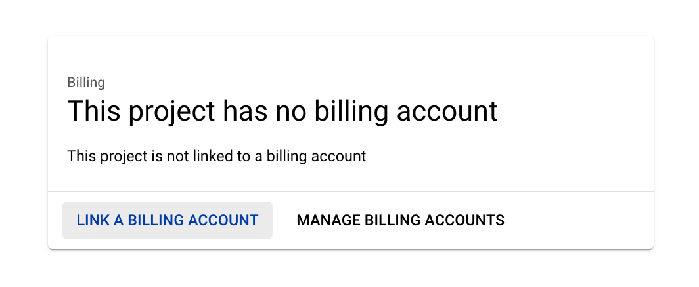
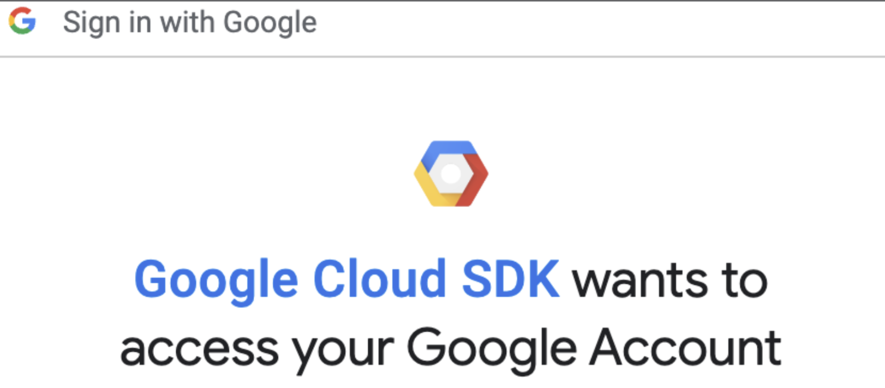
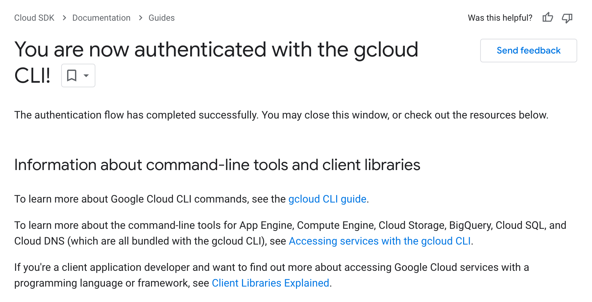

COEN6313: Programming On Cloud> TUT: Google Cloud Run

This tutorial will go through three demo projects for two use cases: (1) Deploying Web services: Websites and (2) Data Processing: Lightweight Data Transformation using **Google Cloud Run**, **Cloud Storage**, **Eventarc (pronunciation: event arch)**, and **BigQuery** services of the Google Cloud Platform.

Before you dive into the coding, you should study the following materials.

There is no need to operate on the Cloud Run; just understand the concepts and know what you will probably do.

- How to use Git and Github: [Youtube: Git Tutorial](https://www.youtube.com/watch?v=8JJ101D3knE&t=3s), [Youtube: GitHub Tutorial](https://www.youtube.com/watch?v=tRZGeaHPoaw).

- Cloud Run:

  - Overall:

    - [What is Cloud Run](https://cloud.google.com/run/docs/overview/what-is-cloud-run): You should understand the concept of "Cloud Run Services" and "Clould Run Jobs."

    - [Is my app a good fit for Cloud Run?](https://cloud.google.com/run/docs/fit-for-run): You should know what kind of work suits Google Cloud Run.

  - For Use Case 1:

    - [Quickstart: Deploy to Cloud Run from a Git Repository](https://cloud.google.com/run/docs/quickstarts/deploy-continuously#cloudrun_deploy_continuous_code-python)

    - [Deploy a Python Service to Cloud Run from Source Code](https://cloud.google.com/run/docs/quickstarts/build-and-deploy/deploy-python-service)

  - For Use Case 2:
    - [Use Eventarc to receive events from Cloud Storage](https://cloud.google.com/run/docs/tutorials/eventarc)

- Cloud Storage:
  - [Discover object storage with the Google Cloud console](https://cloud.google.com/storage/docs/discover-object-storage-console)
  - [About Cloud Storage buckets](https://cloud.google.com/storage/docs/buckets)
- Eventarc:
  - [Eventarc overview](https://cloud.google.com/eventarc/docs/overview)
- BigQuery:
  - [What is BigQuery](https://cloud.google.com/bigquery/docs/introduction)

# 1. Preliminary Setup

1. Install the Google Cloud CLI: https://cloud.google.com/sdk/docs/install, run init, and select the project you just created.

   Verify if the tools by the command:

   ```bash
   gcloud -v
   ```

   and you should get the following output:

   ```bash
   Google Cloud SDK 444.0.0
   bq 2.0.97
   core 2023.08.22
   gcloud-crc32c 1.0.0
   gsutil 5.25
   ```

2. Create your Project on Google Cloud Console at https://cloud.google.com/?hl=en.

   

3. **<<IMPORTANT>>**: **Set up a billing account for your project**.

   

   If you are new to the platform, remember that the platform grants you $400+ credits once your billing is linked.

4. Authorization for the gcloud.

   You should log in first:

   ```bash
   gcloud auth login
   ```

   then it will pull up your browser:

   

   Once allowed, you will see:

   

   Verify your login status with:

   ```bash
   gcloud auth list
   ```

5. Config the project to your gcloud:

   ```bash
   gcloud config set project <your-project-id>
   ```

   The project ID can be found while selecting Project in the Console.

   

6. Set up Billing information, add card as payment to your account (this will charge you 1$~2$, and it will be refunded):

   


7. Enable the following **six** Google Cloud APIs (Updated):

   ```bash
   gcloud services enable run.googleapis.com eventarc.googleapis.com storage.googleapis.com cloudbuild.googleapis.com iam.googleapis.com iamcredentials.googleapis.com
   ```

8. (Optional) Install docker in your local to debug with your Dockerfile.

# 2. Use Case 1: Web Application

There are three approaches to deploying your project as services to Cloud Run:

1. from a published docker image;
2. <u>from a GitHub repository;</u>
3. <u>from your local source code;</u>

> **<u>The following user scenario is presented</u>**: 
>
> You now work on deploying Python and Java web applications to the **<u>*Cloud Run*</u>** through the last two approaches.


## 2.1 Approach 1: Deploy from a Git Repository

Deploying projects on GitHub to Cloud Run can enable the CI/CD workflow between Google Cloud Platform and GitHub.

In the root path of this repository, a simple Flash application in the `main.py` and the `Dockerfile` is for Cloud Run Service to build and deploy the image.

The `Dockerfile`:

```dockerfile
# Use the official lightweight Python image.
# https://hub.docker.com/_/python
FROM python:3.11-slim

# Allow statements and log messages to immediately appear in the logs
ENV PYTHONUNBUFFERED True

# Copy local code to the container image.
ENV APP_HOME /app
WORKDIR $APP_HOME
COPY . ./

# Install production dependencies.
RUN pip install --no-cache-dir -r requirements.txt

# Run the web service on container startup. Here we use the gunicorn
# webserver, with one worker process and 8 threads.
# For environments with multiple CPU cores, increase the number of workers
# to be equal to the cores available.
# Timeout is set to 0 to disable the timeouts of the workers to allow Cloud Run to handle instance scaling.
CMD exec gunicorn --bind :$PORT --workers 1 --threads 8 --timeout 0 main:app

```

In this section, you will focus on the `/` endpoint in the `main.py`:

```python
@app.route("/", methods=['GET', 'POST'])
def hello_world():
    """Example Hello World route."""

    return f"Hello World!!!!!!"
```

### 2.1.1 Steps

Please work on the following steps:

1. Clone this repository ([Youtube: Git Tutorial](https://www.youtube.com/watch?v=8JJ101D3knE&t=3s), [Youtube: GitHub Tutorial](https://www.youtube.com/watch?v=tRZGeaHPoaw)).

2. Go to Cloud Run and create a Cloud Run Service:

   1. Click the Cloud Run panel "CREATE SERVICE."

   2. Select "... from a source repository"; Setup Cloud Build; Authorize to your GitHub account; Select the repository you just cloned.

      

   3. Select the main branch; Select build type "Dockerfile" and locate the file path `/Dockerfile`.

      

   4. Allow unauthenticated invocations and create the service.

      

3. Your code is now created and deployed on Cloud Run.

   

4. Visit the URL of the `hello_world()` endpoint.

   

5. Make some changes in your code and commit it to the GitHub repository.

   

6. Visit the Build History. You should see a new build is processing.

   

7. The change should be updated to the web service.

   


